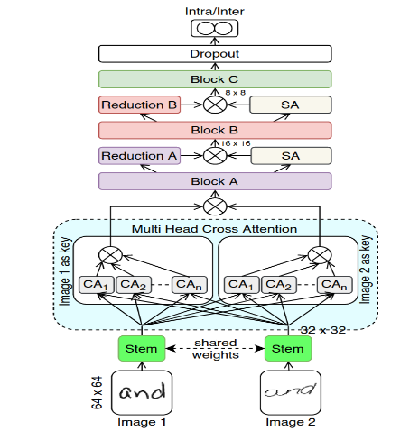
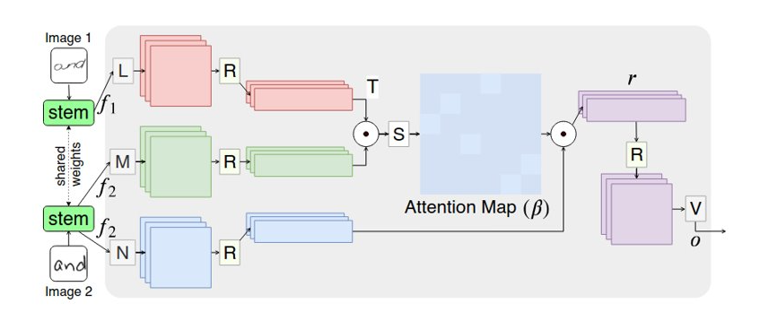
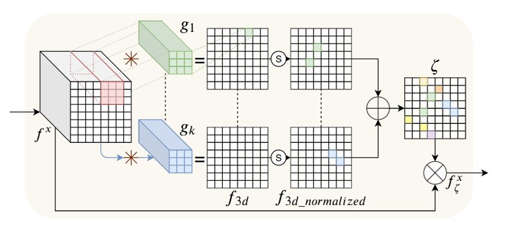
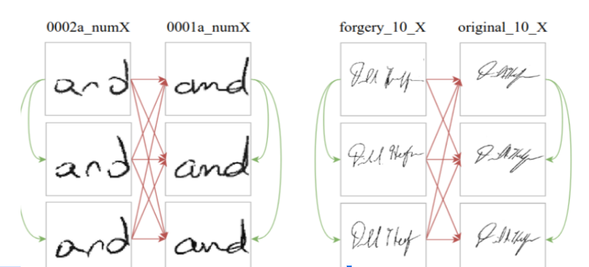

# Attention based Handwriting Verification using VGG16

The proposed system makes handwriting verification using VGG16 architecture ans soft attantion inaddition to cross attention to extract the most important features.




# Cross Attention


# Soft Attention


# Datasets



- Handwritten "AND": https://github.com/mshaikh2/HDL_Forensics
- CEDAR Signature: http://www.cedar.buffalo.edu/NIJ/data

# How to run the code 
1. Install Miniconda/anaconda
2. create new enviroment 
```
conda create -n 

conda activate 

pip install tensorflow-gpu

```
3. Install a suitable CUDA version 

```
conda install -c conda-forge cudatoolkit=11.2 cudnn=8.1.0
```
4. Add dataset paths 
5. Add the path of checkpoints folder that contains the weights file *cross_attention_residual_vgg_fold_1.h5*


# Citation
```
@INPROCEEDINGS{
  9257763
  ,  author={M. A. {Shaikh} and T. {Duan} and M. {Chauhan} and S. N. {Srihari}}
  ,  booktitle={2020 17th International Conference on Frontiers in Handwriting Recognition (ICFHR)}
  ,  title={Attention based Writer Independent Verification}
  ,  year={2020}
  ,  pages={373-379}
  ,  doi={10.1109/ICFHR2020.2020.00074}
}
```

