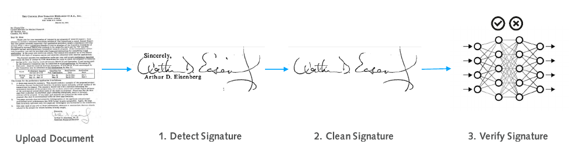
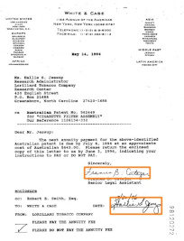
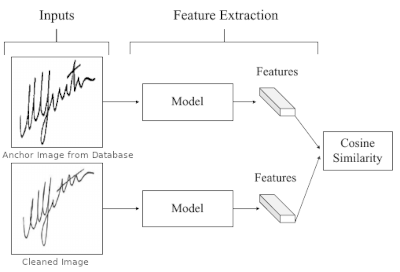
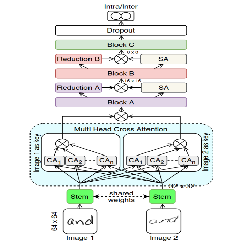
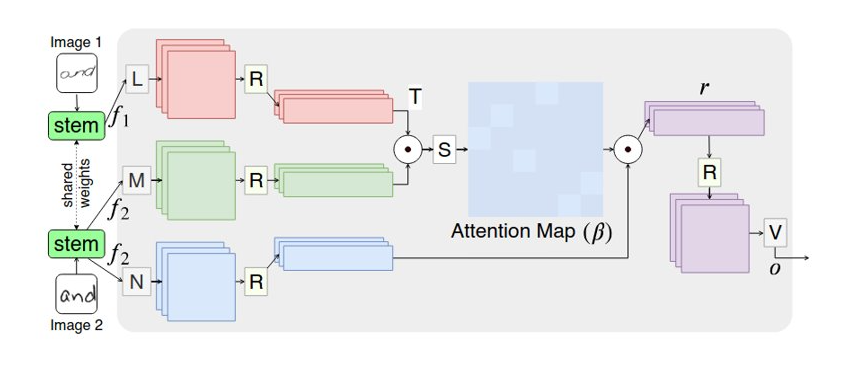
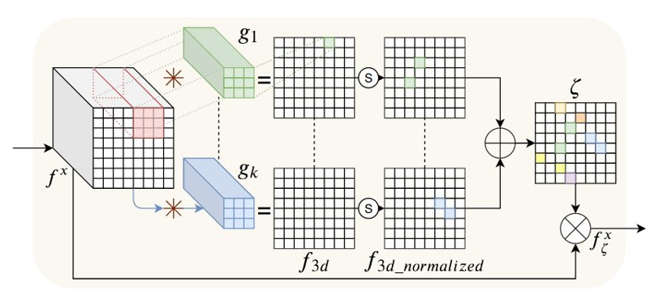

# Three-Different-Techniques-for-Signature-Verification

### The first technique is Signature-Verification_System_using_YOLOv5-and-CycleGAN:
#### This system works in three phases.

#### Signature Detection using YOLOv5
 

#### Signature Cleaning using CycleGAN
  

#### Signature Verification using Siamese Networks
 

### The second technique is Attention based Handwriting Verification using VGG16:
#### The proposed system makes handwriting verification using VGG16 architecture ans soft attantion inaddition to cross attention to extract the most important features.

#### Cross Attention

#### Soft Attention

### The second technique is Signature Detection using Machine Learning (ML) 
