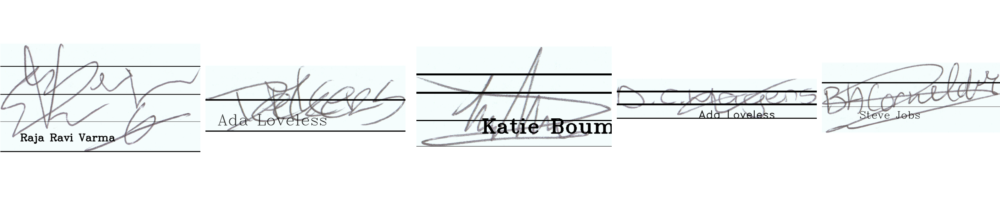

## Signature Cleaning with CycleGAN
The official repo of **CycleGAN** can be found [here](https://github.com/junyanz/pytorch-CycleGAN-and-pix2pix). We use it to train the model to work with our Signature detection use case.  
Since CycleGANs are able to learn the underlying mapping between two domains A and B, it could be extended to our use case for signature cleaning. This technique is defined in [this paper](https://arxiv.org/abs/2004.12104). For training I used the [Kaggle Signature Dataset](https://www.kaggle.com/robinreni/signature-verification-dataset) for the domain A (clean signatures.) I generated the noisy signatures by adding random lines and texts at random positions in the clean images using [this notebook](CycleGAN-Data_Preperation_Adding_Noise.ipynb).  
  
CycleGANs requires square images for training, so to standardize the images, I wrote code for resizing the images to a 512x512 square with the signature at the center and two black (transparent) strips at the top and bottom of the image.  
  
We also have to store the data folders in a particular structure. There should be sub-folders testA, testB, trainA, and trainB inside `datasets\dataset_name`. In trainA/testA, place the clean images (domainA) and in trainB/testB, place the noisy images.  
`datasets`  
&nbsp;&nbsp;&nbsp;&nbsp; |-> `dataset_name`  
&nbsp;&nbsp;&nbsp;&nbsp;&nbsp;&nbsp;&nbsp;&nbsp; |-> `trainA`   
&nbsp;&nbsp;&nbsp;&nbsp;&nbsp;&nbsp;&nbsp;&nbsp; |-> `trainB`   
&nbsp;&nbsp;&nbsp;&nbsp;&nbsp;&nbsp;&nbsp;&nbsp; |-> `testA`   
&nbsp;&nbsp;&nbsp;&nbsp;&nbsp;&nbsp;&nbsp;&nbsp; |-> `testB`   
  
The code required to do *to generate noisy images*, *to structure the dataset into CycleGAN folder structure* and *to convert the images into a standardized form* could be found in [this notebook.](CycleGAN-Data_Preperation_Adding_Noise.ipynb)  
  
## Training the model.
**Use [this notebook](SignatureCleaningCycleGAN.ipynb) to train and test the CycleGAN model.**  
The data in CycleGAN format is available [here](https://drive.google.com/drive/u/0/folders/1397Q9nqMqEsSesB9UvlIL1u1IGzrUOIK) as a zip file.  

Clone the official [CycleGAN repo] and install the requirements using the `requirements.txt` file.  
Our signature dataset must to be added to the `datasets` folder of the cloned repository.  
  
  
The following line could be used to train the model.  
`python train.py --dataroot ./datasets/dataset_name --name model_name --model cycle_gan`  
  
Change the `--dataroot` and `--name` to the custom dataset path and model name.  
Use `--gpu_ids` 0,1,.. to train on multiple GPUs.  
The model_name we use for testing should be consistent with the model_name we used for training as well.  
> `!python train.py --dataroot ./datasets/gan_signdata_kaggle --name gan_signdata_kaggle --model cycle_gan`  
  
**Training arguments**
By default, the model trains for 100 epochs, to train for more epochs, use `--n_epochs #epoch_count`. The model will be trained for (100 + epoch_count) epochs.  
To continue training after you stop the training, use `--continue_train` and set `--epoch_count #epoch_number`. This will resume the training from *epoch_number* epoch.
eg: `--continue_train --epoch_count 110` will resume the training from epoch 110.
  
  
The model can translate the image in both directions (noisy to clean and clean to noisy). For our use case, we have to translate from noisy to clean. So after training, copy the latest Generator(B) `/checkpoints/model_name/latest_net_G_B.pth` as `latest_net_G.pth` under `/checkpoints/model_name/latest_net_G.pth`. (see under testing section)
  
  
  
  
## Testing the model

-   `python test.py --dataroot datasets/dataset_name/testA --name model_name --model test --no_dropout`

Change the `--dataroot` and `--name` to be consistent with your trained model's configuration.

> from https://github.com/junyanz/pytorch-CycleGAN-and-pix2pix:
> The option --model test is used for generating results of CycleGAN only for one side. This option will automatically set --dataset_mode single, which only loads the images from one set. On the contrary, using --model cycle_gan requires loading and generating results in both directions, which is sometimes unnecessary. The results will be saved at ./results/. Use --results_dir {directory_path_to_save_result} to specify the results directory.

> For your own experiments, you might want to specify --netG, --norm, --no_dropout to match the generator architecture of the trained model.  
  

**To copy the latest generator model, use the follwing code.**  
`cp ./checkpoints/gan_signdata_kaggle/latest_net_G_B.pth ./checkpoints/gan_signdata_kaggle/latest_net_G.pth`  
  
Clean images could be generated using `test.py`.  
> `!python test.py --dataroot datasets/gan_signdata_kaggle/testB --name gan_signdata_kaggle --model test --no_dropout`  
  

